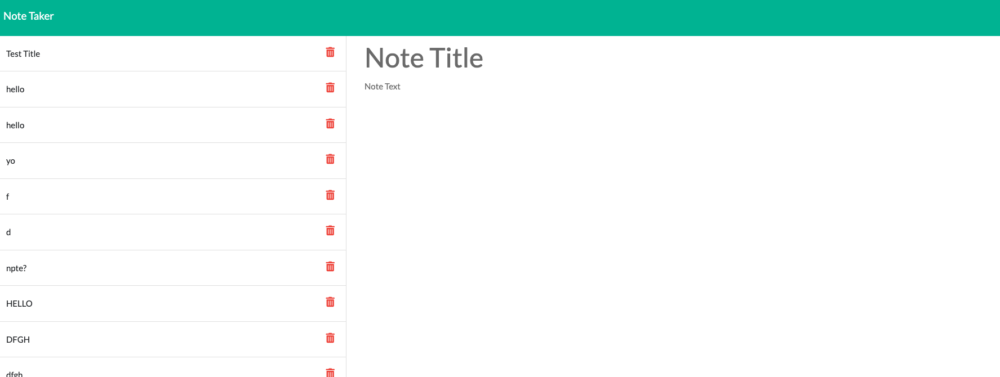

 # NOTETAKER APPLICATION   

  ## Project Description 

  An app where you can create and delete notes in realtime.

  # Table of Contents

  - [Usage](#usage)

  - [License](#license)

  - [Contributing](#contributing)

  - [FAQ](#faq)

  ## Usage 

  Deployed with Heroku via https://protected-refuge-68070.herokuapp.com/
  Use to store your notes as long as you include Title and Text content. Press the save button to add to the right hand column, and the corresponding delete buttons to remove from database.
  
  

  ## License 

  MIT License

  ## Contributing 

  Make it better. Become a contributer. See contact info below.

  ## FAQ 
  * shadin.alarab@gmail.com
  * https://github.com/shadin-a
  * Feel free to reach me via my carrier pigeon, Hank.

  
